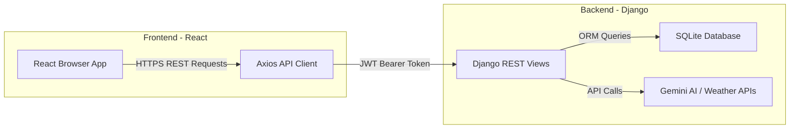

# TripPilot AI: Beginner's Architecture & Code Guide

Welcome to **TripPilot AI**! This guide is designed to help beginner developers understand the architecture, folder structure, code flow, and core concepts used in this project. By the end of this guide, you will know exactly how the frontend (React) and backend (Django) work together, and how you can run and extend them.

---

## 1. High-Level Architecture

TripPilot AI is a **full-stack web application** that operates on a Client-Server architecture:



1. **Frontend (React)**: Running in the user's browser, it displays the visual elements (pages, inputs, maps) and listens for user actions (clicks, form submits).
2. **Backend (Django & Django REST Framework)**: Running on a local server (`localhost:8000`), it acts as an API. It receives data requests, performs validation, queries the database, and queries external services (like Gemini AI for itineraries).
3. **Database (SQLite)**: A simple file-based database (`db.sqlite3` in the backend folder) that stores users, itineraries, expenses, profiles, and trip details.

---

## 2. Directory Structure Explained

### Frontend (`/frontend`)
This is a standard React application initialized with Vite.
- **`index.html`**: The main entry page. Vite injects your React app into the `<div id="root"></div>` tag here.
- **`src/main.jsx`**: The Javascript file that bootstraps (starts) React and attaches the app to `index.html`.
- **`src/App.jsx`**: The main component containing the **routing table** (which URL maps to which page).
- **`src/index.css`**: The global styling system defining the corporate colors, typography, and Bootstrap overrides.
- **`src/components/`**: Smaller, reusable user interface elements:
  - `Navbar.jsx` / `Footer.jsx`: Sticky layout components.
  - `ProtectedRoute.jsx`: Intercepts non-logged-in users trying to access pages like `/dashboard`.
  - `TripMap.jsx` / `ExpensesTab.jsx`: Tab panels used on detailed views.
- **`src/pages/`**: Full page components representing routes:
  - `Home.jsx`: Redesigned corporate landing page.
  - `Login.jsx` / `Register.jsx`: Clean sign-in forms.
  - `Dashboard.jsx`: Shows user stats and summary of upcoming/completed trips.
  - `TripPlanner.jsx`: The multi-step form to input options and trigger AI trip planner.
- **`src/context/`**:
  - `AuthContext.jsx`: Holds the active user state (`user`), loading indicators, login/logout functions, and shares them globally using React's **Context API**.
- **`src/services/`**:
  - `api.js`: Configures **Axios** to add security headers and auto-refresh expired login sessions.

---

### Backend (`/backend`)
A python-based Django project split into apps.
- **`manage.py`**: The CLI command-line utility used to run the server, run migrations, and execute shell scripts.
- **`travel_companion/`**: The core configurations.
  - `settings.py`: Contains configurations for database connections, installed apps, password validators, CORS settings, and security parameters.
  - `urls.py`: The entry point routing table for the HTTP endpoints (e.g. directing `/api/users/` requests to the `users` app).
- **`users/`**: App managing account logic.
  - `models.py`: Custom User and Profile database schemas.
  - `serializers.py`: Transforms python DB records to JSON (and validates inbound registration request formats).
  - `views.py`: Python controllers that intercept registration, login, profile updates, and the public leaderboards.
- **`trips/`**: App managing itineraries, AI integration, maps, expenses, and logs.
  - `models.py`: Defines database schemas for `Trip`, `ItineraryDay`, `Expense`, and `Journal`.

---

## 3. How the Frontend Communicates with the Backend

The frontend and backend communicate via **REST APIs** using **JSON** payloads.

### JSON Web Tokens (JWT) Authentication
Instead of cookies, this project uses standard secure token authentication:
1. When you type your email and password on the **Login Page** and press submit:
   - React sends a POST request with `{ "email": "...", "password": "..." }` to `/api/users/login/`.
   - The Django server checks if the password matches. If it does, it returns two tokens:
     - **Access Token**: A short-lived credential (valid for 24 hours) sent with every API request header:
       `Authorization: Bearer <your_access_token>`
     - **Refresh Token**: A long-lived credential (valid for 7 days) stored locally to fetch new access tokens without forcing the user to log in again.
2. React saves these tokens in the browser's **localStorage** (which acts like a client-side database).

### Axios Interceptors (`frontend/src/services/api.js`)
To avoid manually writing header codes for every request, we use Axios interceptors:
- **Request Interceptor**: Automatically intercepts every outgoing HTTP request, reads the `accessToken` from `localStorage`, and injects it into the `Authorization` header.
- **Response Interceptor**: Intercepts incoming responses. If the backend returns a `401 Unauthorized` (indicating the Access Token has expired), the interceptor automatically:
  1. Pauses the current operation.
  2. Sends the `refreshToken` to `/api/users/token/refresh/` to get a new access token.
  3. Saves the new token in `localStorage`.
  4. Retries the original user request with the new token.
  *(If the refresh token itself is expired, it clears session storage and redirects you to the login page).*

---

## 4. Key Concepts Explained for Beginners

### A. What is a Model? (Backend)
A Model is a Python class representing a table in your SQLite database. For example:
```python
# users/models.py
class Profile(models.Model):
    user = models.OneToOneField(User, on_delete=models.CASCADE)
    avatar = models.ImageField(upload_to='avatars/')
    bio = models.TextField(max_length=500)
    loyalty_points = models.IntegerField(default=0)
```
*Behind the scenes, Django translates this code into SQL code that creates a database table containing `user_id`, `avatar`, `bio`, and `loyalty_points` columns.*

### B. What is a Serializer? (Backend)
Django models speak Python (objects), but React speaks Javascript (JSON). Serializers bridge this gap. They translate database records into JSON:
```python
# users/serializers.py
class ProfileSerializer(serializers.ModelSerializer):
    class Meta:
        model = Profile
        fields = ['avatar', 'bio', 'loyalty_points']
```
- **Serialization (GET)**: Database Record $\rightarrow$ Serializer $\rightarrow$ `{ "bio": "Hello World", "loyalty_points": 100 }`
- **Deserialization (POST/PUT)**: User JSON $\rightarrow$ Validation Checks $\rightarrow$ Saved Database Row.

### C. What is a Context Provider? (Frontend)
React components pass data down to children via properties ("props"). Passing data down through 10 layers of nested components is tedious (called "prop-drilling"). 
**Context** creates a global cloud of data that any nested component can directly download without passing props manually.
```jsx
// AuthContext.jsx
export const AuthProvider = ({ children }) => {
  const [user, setUser] = useState(null);
  
  return (
    <AuthContext.Provider value={{ user, login, logout }}>
      {children}
    </AuthContext.Provider>
  );
};
```
*Inside any file (e.g. `Navbar.jsx`), you can access the user state instantly by importing `const { user } = useAuth();`.*

---

## 5. Development Server Quickstart

Follow these steps to spin up the local server environments on your computer:

### Step 1: Run the Django Backend
1. Open a terminal and navigate to the backend folder:
   ```bash
   cd backend
   ```
2. Activate your virtual environment and install requirements:
   ```bash
   pip install -r requirements.txt
   ```
3. Sync the database schemas (run migrations):
   ```bash
   python manage.py migrate
   ```
4. Start the backend development server:
   ```bash
   python manage.py runserver
   ```
   *(Your backend API is now running at `http://127.0.0.1:8000/api/`)*

### Step 2: Run the React Frontend
1. Open a new terminal and navigate to the frontend folder:
   ```bash
   cd frontend
   ```
2. Install npm dependencies:
   ```bash
   npm install
   ```
3. Start the Vite dev server:
   ```bash
   npm run dev
   ```
   *(Your web app is now running at `http://localhost:5174/`)*

---

## 6. How to create an Admin / Superuser
To access Django's native administrator dashboard (`http://127.0.0.1:8000/admin`), you can create a Superuser:
1. Open a terminal in the `/backend` folder.
2. Run this command:
   ```bash
   python manage.py createsuperuser
   ```
3. Enter your email, username, and password when prompted. You can now use those credentials to manage all records directly!

---

## 7. Custom UI Branding & Visual Systems

We have upgraded **TripPilot AI**'s frontend styling using clean global CSS overrides and standard card layouts to match a modern **Royal Blue, Cyan, and Slate** theme.

### A. Dynamic Color Customization (`index.css`)
Rather than rewriting CSS rules for every React component, we defined all visual elements inside global variables in `:root` of `index.css`:
- `--color-primary`: Royal Blue (`#2563eb`) - Applied to primary buttons, highlights, and active elements.
- `--color-secondary`: Teal-ish Cyan (`#06b6d4`) - Applied to secondary labels, ratings, and card highlights.
- `--color-bg-page`: Slate 50 (`#f8fafc`) - The main layout canvas background.
- `--font-heading`: Poppins (`'Poppins', sans-serif`) - Handled headers and title components.

### B. High-Contrast Dark Navigation Bar
To create a modern header layout, the navigation bar was converted to a deep navy dark theme (`#0f172a` background):
- Outbound links use semi-transparent white colors (`rgba(255, 255, 255, 0.75)`) and brighten to solid white on hover.
- To prevent the username ("Hi, Sridhar") and the currency toggle from blending into the dark background, we added custom namespace rules targeting `.custom-navbar .text-muted` and `.custom-navbar #currencyDropdown` to enforce high contrast white text states.

### C. Category-Based Curated Travel Photos
To enrich the Trip Details view without slow geocoding calls, we declared static arrays of premium, high-resolution travel photos from Unsplash for each tab (Accommodation, Restaurants, Attractions, Weather).
- When a user views a trip, React loops through the lists using index modulo math:
  `src={HOTEL_IMAGES[idx % HOTEL_IMAGES.length]}`
- This dynamically assigns a gorgeous, relevant, high-resolution photo to every card that is guaranteed to load instantly without breaking!
